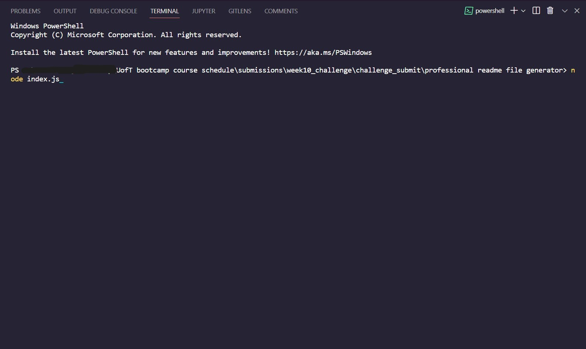

# 
 **My generated example ReadMe** 

---

## 
 *Description* 

  A simple `ReadMe.md` file auto-generated on answering related questions in `terminal (integrated in vscode or gitBash)` and by using only `javascript (node.js, npm and inquirer pkg)`.

## 
 *Languages Used* 

  Javascript,Node.js

---

## *Table of Contents*

* [Installation](#Installation)
* [Usage](#Usage)
* [Links](#Links)
* [Credits](#Credits)
* [License](#License)
* [Badges](#Badges)
* [Questions](#Questions)
* [Tests](#Tests)

---

## *Installation*

  Type `"npm i"` or `"npm install"`, without quotes, in terminal (vscode integrated one or gitBash) which will install the required node_modules (in this case only inquirer pkg) package dependencies folder in directory. Once that is done, type in `"node index.js"`, without the quotes, to start the creation process.            A quick preview gif of both the js codes (generateMarkdown & index): 

## *Usage*

  After the above steps are taken care of, answer a list of questions as per required to generate the file. Once that is done, a `'success'` statement will pop up in terminal and a file will be saved in the directory, ready to be used.      

## *Links*

Github Links

>[A-N26](https://github.com/A-N26)

* >[Professional-ReadMe-file-generator](https://github.com/A-N26/professional-readme-file-generator)

* >N/A

> [Walkthrough video](https://drive.google.com/file/d/1xHJWV7orjlRSNYMwwFgmxxO9vX4rOCbM/view)

## *Credits*

  Followed [readme-guide](https://coding-boot-camp.github.io/full-stack/github/professional-readme-guide) to structure the generated ReadMe accordingly.      Used [dev.to](https://dev.to/envoy_/150-badges-for-github-pnk#ide) link for some `badges`.      Used [choosealicense](https://choosealicense.com/) to include all the different licences along with 1 from [creativecommons](https://creativecommons.org/publicdomain/mark/1.0/).      Google/Youtube

## *License*

  **(Please Click the BADGE for the license details.)**

  

## *Badges*

      

## *Questions*

If you would like to as me anything (ama) about the project, please contact me on the email mentioned below (or if you would like to contact via GitHub the link to my profile in mentioned in the links section up above!):

* >[My e-mail](A-N26@github.com)

## *Contributing*

  Please do not hesitate to fork this repo. And, there-after, create a new branch and commit, push that branch and create a pull request.☻

## *Tests*

  N/A
